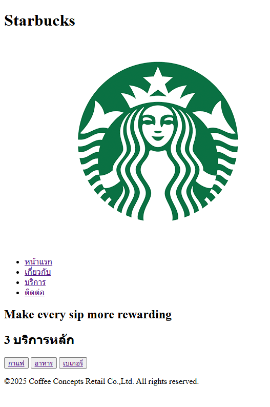
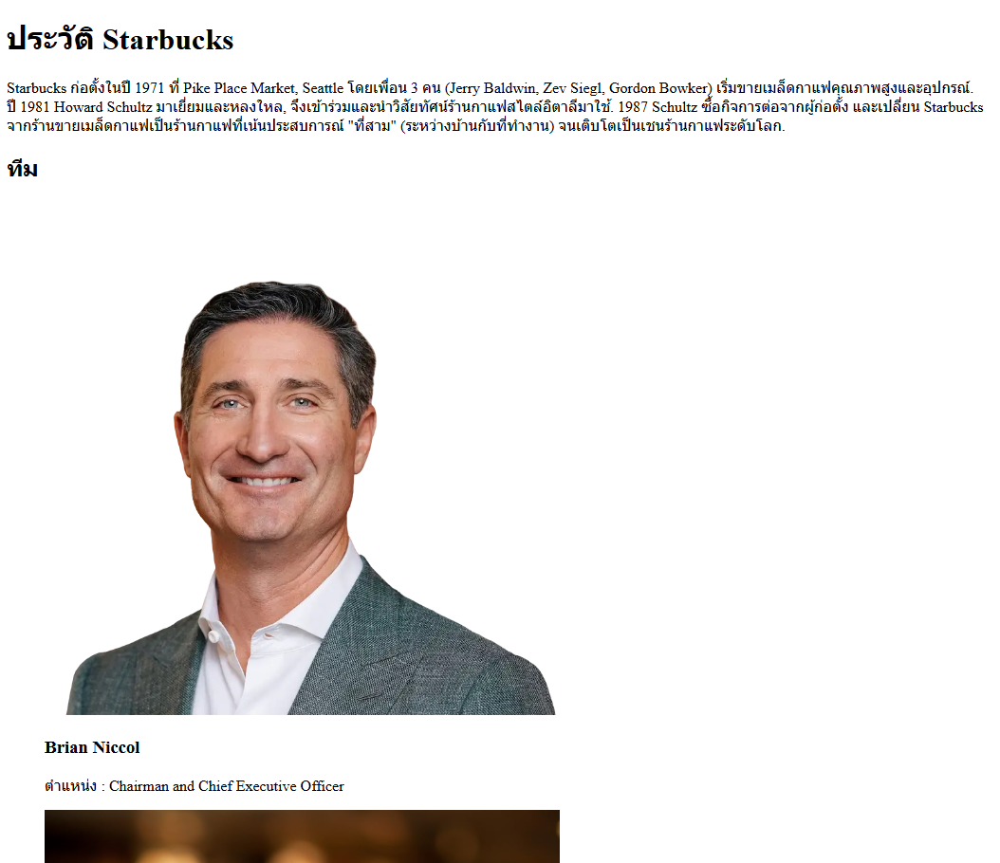
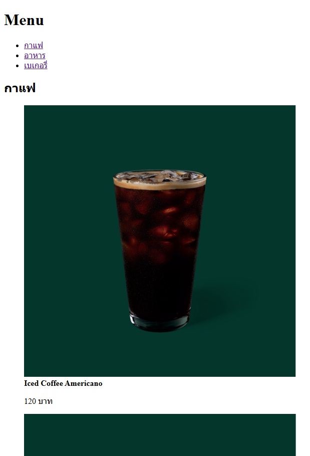

# Create Starbucks Website

## Description

- โปรเจกต์นี้คือการจำลองโครงสร้างพื้นฐานของเว็บไซต์ Starbucks โดยใช้ HTML (HyperText Markup Language) เป็นหลักในการจัดวางเนื้อหาและกำหนดโครงสร้างของหน้าเว็บ

## File Structure

- **index.html** - หน้าหลักของเว็บ Starbucks
- **about.html** - บอกข้อมูลเกี่ยวกับเว็บ Starbucks
- **services.html** - บริการต่างๆ ของ Starbucks เช่น กาแฟ อาหาร
- **contact.html** - ช่องทางการติดต่อ ที่ตั้งของ Starbucks
- **images/** - โฟลเดอร์เก็บไฟล์รูปภาพต่างๆ ที่นำมาใช้
- **README.md** - เอกสารอธิบายข้อมูลต่างๆ

## Web Screenshots

1. [หน้าหลัก/index.html](/index.html)

   

2. [เกี่ยวกับ/about.html](/about.html)

   

3. [บริการ/services.html](/services.html)

   

4. [ติดต่อ/contact.html](/contact.html)

   
